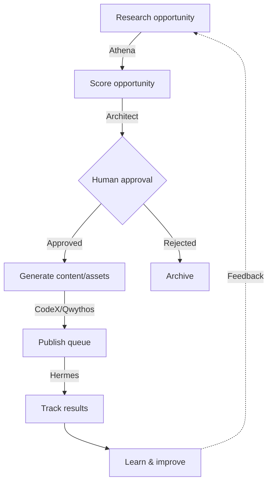

# Target Architecture: Revenue Engine

## Goal
Establish a single, monetizable business workflow cleanly integrated into the existing Agentic OS UI, prioritizing a focused revenue-generation loop over generalized AI capabilities.

## The Revenue Engine Workflow Loop

## UI Mapping & Design Recommendations

### 1. Pipeline: Primary Home of the Revenue Engine
- **Recommendation**: Repurpose `PipelineBoard.tsx` from a static 4-stage map to the canonical visualization of the Revenue Engine loop.
- **Why Pipeline?**: The Pipeline is structurally designed to represent sequence, agent handoffs, and macro-state. Visualizing the health and volume of opportunities flowing through the 7 stages of the Revenue Engine belongs here. It should become dynamic.

### 2. Boards: The Operational Queue
- **Recommendation**: Repurpose Kanban boards to represent "Revenue Opportunities" instead of generic tasks.
- **Role**: Cards represent specific campaigns, products, or experiments moving left-to-right through drafting, research, generation, and approval.

### 3. Control Room: The Approvals & KPIs Dashboard
- **Recommendation**: Maintain as the central hub, but elevate business logic.
- **Role**: Add an "Approvals Inbox" for Human Approval gates. Display core KPIs (conversion rates, yield, active campaigns) and system-wide business alerts.

### 4. Research: The Evidence Workspace
- **Recommendation**: Keep as the specialized canvas for Athena.
- **Role**: Gather competitor data, market trends, and source links that will be attached to specific Revenue Opportunity records for downstream generation.

### 5. Hermes Studio: The Publish Queue
- **Recommendation**: Keep as the staging/delivery terminal.
- **Role**: Final human-in-the-loop review of generated assets before they are pushed to external APIs or published.

### 6. Runs / Skills / CodeX
- **Recommendation**: Keep as underlying infrastructure.
- **Role**: CodeX for building/scripting, Skills for tool management, Runs for trace debugging.

### 7. Ornith Dashboard
- **Recommendation**: Hide or Repurpose.
- **Why?**: Ornith (`OrnithDashboard.tsx`) serves as an experimental voice/local takeover interface. It is orthogonal to a structured, repeatable business workflow and could clutter the UI for operators. For clarity, it should be moved to a "Labs" section or hidden during standard Revenue Engine operations.

## Missing Backend Infrastructure

To support the Revenue Engine, the backend requires the following new primitives:

1. **Revenue Work Items & Approval States**: 
   - A `revenue_opportunities` table containing `status` (e.g., `researching`, `needs_approval`, `approved`, `rejected`), `score`, and JSON content blobs.
2. **Workflow Runs**: 
   - Mechanisms to link `revenue_opportunities` to specific `runs` (foreign keys) so execution traces belong to a business goal.
3. **Evaluation Records & KPI Tracking**: 
   - A `revenue_metrics` table or time-series store to track expected vs actual yield, clicks, and revenue.
4. **Prompt/Version Experiments**: 
   - Structured JSON schemas attached to the opportunities to A/B test system prompts against business results.
