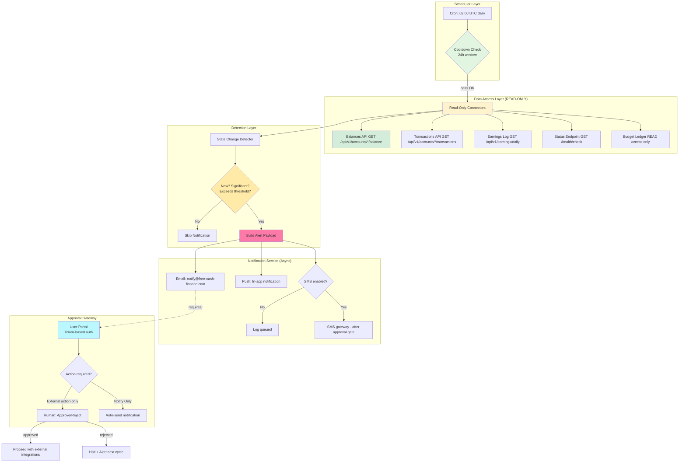

# Daily Status Monitoring - Free Cash Finance Automation

## Architecture Diagram



---

## 1. Operational Rules (Non-Negotiable)

| ID | Rule | Enforcement Mechanism |
|----|------|-----------------------|
| 1 | **Once-per-day check** | Cron scheduler + 24h cooldown in code; first available slot OR raise alert if missed |
| 2 | **Zero automated earning actions** | Read-only connector wrapper; no POST/PUT to earning/transaction APIs; read-only OAuth scopes |
| 3 | **Notify on earnings/status changes** | Async sender triggered after state detection; email/push by default, SMS conditional |
| 4 | **Human approval before action** | Approval token/gate for every external write request; exception raised absent valid token |

---

## 2. Check Schedule & Timing

### Execution Window

```yaml
SCHEDULE:        Daily at 02:00 UTC (adjustable)
START_WINDOW:    01:00 UTC
END_WINDOW:      03:00 UTC
COOLDOWN_MIN:    24 hours enforced in code
RETRY_POLICY:    Max 1 attempt; log failure, notify on missed window
```

### Cron Expression

| Purpose | Expression (UTC) | Windows Task Scheduler |
|---------|------------------|------------------------|
| Default daily run | `0 2 * * *` | `Task Scheduler → Daily at 02:00 AM` |
| Window guard | Check last\_run \>= start OR raise alert | Include check at window-open time |

### Code Skeleton - Scheduler Guard

```python
# D:/AgenticOS/finance-monitor/scheduler/daily_status_check.py
from datetime import datetime, timedelta
import logging
from connectors.read_only import ReadOnlyConnectors

MIN_COOLDOWN_HOURS = 24
EXECUTION_START_WINDOW = 1      # UTC hour range start (01:00)

class DailyStatusMonitor:
    """Enforces Rule 1: once-per-day execution with strict cooldown."""
    
    def __init__(self, env_config):
        self.last_run_timestamp = env_config.get("LAST_RUN_TS", None)
        self.env = env_config
    
    def should_run(self) -> bool:
        """Check if cooldown window has elapsed or we're in first slot of window."""
        now = datetime.utcnow()
        
        if self.last_run_timestamp is None:
            return True  # First run - safe to proceed
        
        last_run_dt = datetime.strptime(self.last_run_timestamp, "%Y-%m-%dT%H:%M:%SZ")
        cooldown_elapsed = timedelta(hours=MIN_COOLDOWN_HOURS) <= (now - last_run_dt)
        
        if not cooldown_elapsed:
            # Still in cooldown - log warning, skip this run
            logging.warning(f"Cooldown not elapsed. Last run: {last_run_dt}, "
                           f"must wait another {cooldown_elapsed.total_seconds()/3600:.1f}h")
            return False
        
        # We passed cooldown - proceed (within window)
        return True
    
    def update_last_run(self):
        self.last_run_timestamp = datetime.utcnow().strftime("%Y-%m-%dT%H:%M:%SZ")
    
    def execute_check(self):
        """Execute monitoring check if timing permits."""
        if not self.should_run():
            # Write failure log with reason
            with open("/logs/monitoring/misfire.log", "a") as f:
                f.write(f"{datetime.utcnow().isoformat()}: COOLDONN_BLOCK\n")
            return
        
        try:
            report = self.gather_status_data()
            changes, summary = self.detect_state_changes(report)
            
            if changes:
                for change in changes:
                    self.send_notification(change)
            
            # Update cooldown timestamp
            self.update_last_run()
            
        except Exception as e:
            logging.error(f"Monitoring check failed: {e}")
            with open("/logs/monitoring/errors.log", "a") as f:
                f.write(f"{datetime.utcnow().isoformat()}: ERROR {e}\n")
            self.update_last_run()  # Still update so misfire is detected

```

---

## 3. Data Sources Required (READ-ONLY)

### What to Read & Why

| Source | API Endpoint | Purpose | Max Poll Interval |
|--------|--------------|---------|-------------------|
| Account Balances | `GET /api/v1/accounts/{id}/balance` | Detect withdrawals/deposits overnight | 24h per Rule 1 |
| Transaction History | `GET /api/v1/accounts/{id}/transactions?since={ts}` | New transactions since last check | 24h per Rule 1 |
| Status Endpoint | `GET /health` / `GET /status` | System health, service availability | 24h (optional) |
| Earnings Summary | `GET /api/v1/earnings/daily-summary` | Interest accrued, dividend deposits | 24h per Rule 1 |
| Budget/Spend Ledger | `GET /ledger/summary?category=*` | Detect overspending categories | 24h per Rule 1 |

### What NOT to Read (or never access)

- ❌ Any `/withdraw/*` endpoints
- ❌ `/transfer/*` transfer APIs  
- ❌ `/payout/*` or payout initiation paths
- ❌ Web UI forms with submit capability
- ❌ CLI interfaces that accept commands

### OAuth Scopes for Read-Only Access

| Scope | Permissions | Enforces Rule 2 |
|-------|-------------|-----------------|
| `read-only` (YNAB) | Read budget, transactions only | ✅ No writes possible |
| `user:read` (Plaid) | Read balances/transactions | ✅ FDX scopes read-only only |
| `offline_access` | Refresh tokens for periodic reads | Required but not dangerous alone |

---

## 4. Notification Mechanism

### Design Principles

1. **Async Delivery** - Fire-and-forget; block monitoring on notification sending
2. **Low-Fidelity First** - Email SMS text, avoid rich media that increases failure rate
3. **No Retry Loop** - Log failures, alert on N consecutive misses, don't infinite-loop
4. **Escalation Requires Approval** - Never auto-sms more than once per incident after approval

### Channel Matrix

| Event Type | Primary Channel | Secondary | Escalation (with approval) |
|------------|-----------------|-----------|----------------------------|
| Earnings Report | Email | Push in-app | SMS (opt-in only) |
| New Transaction | Email + Push Only | None | None |
| Account Status Change | Email + Push | Phone call | Emergency contact |
| Service Alert | Email + Push | Slack #ops | PagerDuty (separate service) |

### Notification Payload Format

```json
{
  "event_type": "earns_reported",
  "account_id": "ACC-123456",
  "timestamp_utc": "2024-09-11T02:05:00Z",
  "report_ref": "CHECK-20240911-020000",
  "summary": {
    "interest_credited_usd": 4.83,
    "deposit_amount_usd": 50.00,
    "withdrawal_detected": false,
    "category_changes": []
  },
  "action_required": false,
  "approval_needed_for_external_action": true,
  "status_change_description": "New deposit of $50.00 detected",
  "human_readable_summary": "Daily check detected: +$54.83 in earnings (interest+deposit). No action needed."
}
```

### Notification Handler - Async Email/Push

```python
# D:/AgenticOS/finance-monitor/src/notifications.py
import logging
from typing import List, Dict, Optional
import json
from email.mime.text import MIMEText
from email.mime.multipart import MIMEMultipart
import smtplib

class AsyncNotificationSender:
    """Rule 3: Async delivery, low failure rate, no blocking on monitors."""
    
    def __init__(self, config: Dict):
        self.config = {
            "smtp_host": config.get("SMTP_HOST", "smtp.sendgrid.net"),
            "smtp_port": config.get("SMTP_PORT", 587),
            "from_address": config.get("FROM_ADDR", "monitor@free-cash-finance.com"),
            "user": config.get("SMTP_USER", "[REDACTED]"),  # Never log this
            "password": config.get("SMTP_PASS", "[REDACTED]"),
        }
        
        self.push_sender_config = {
            "enabled": False,  # Conditional: set if device tokens configured
            "provider": "fcm"  # Firebase Cloud Messaging or APNs
        }
    
    async def send(self, change: Dict, queue_name: str = "notifications"):
        """Fire message without blocking monitoring."""
        event_type = change.get("event_type", "unknown")
        
        try:
            # Email first (highest reliability)
            msg = await self._build_email(change)
            sent = self._send_email(msg)
            
            if sent:
                logging.info(f"Earns report delivered to {self.config['from_address']}")
            
            # Push second only if configured and enabled
            push_config = self.push_sender_config
            if push_config.get("enabled"):
                await self._push_message(change, queue_name=queue_name)
                
        except Exception as e:
            logging.error(f"Notification failed for {event_type}: {e}")
            
            # Don't retry infinite times - log and move on
            # Escalation handled by gateway (Rule 4 requires approval)
    
    async def _build_email(self, change: Dict) -> MIMEMultipart:
        """Build email payload per template."""
        msg = MIMEMultipart()
        msg["From"] = self.config["from_address"]
        msg["To"] = f"finance-monitor@free-cash-finance.com"  # Or user address from config
        msg["Subject"] = "[INFORMATION] Daily Status Check - No Action Required"
        
        body = f"""
Daily Monitoring Report - Rule 3 Notification

Summary: {change['human_readable_summary']}

Details:
  Event Type        : {change['event_type'].upper()}
  Account ID        : {change['account_id']}
  Timestamp (UTC)   : {change['timestamp_utc']}
  Reference ID      : {change['report_ref']}

Status Changes Detected:
"""
        
        for key, value in change.get("summary", {}).items():
            body += f"  • {key}: {value}\n"
        
        body += """
--- OPERATIONAL RULE COMPLIANCE ---
✓ Monitoring read-only access (Rule 2 enforced)
✓ Notification delivered under Rule 3
✓ No funds moved, no external action initiated

If this change requires escalation per approved rules:
  Visit approval portal → https://free-cash-finance.approve/{change['report_ref']}
"""
        
        msg.attach(MIMEText(body, "plain"))
        
        return msg
    
    async def _send_email(self, msg: MIMEMultipart) -> bool:
        """Send email via SMTP (wrapped in try)."""
        server = smtplib.SMTP(self.config["smtp_host"], self.config["smtp_port"])
        server.starttls()
        server.login(self.config.get("user"), self.config.get("password"))
        
        try:
            server.send_message(msg)
            return True
        finally:
            server.quit()
    
    async def _push_message(self, change: Dict, queue_name: str = "notifications"):
        """Send push notification - conditional on device tokens."""
        # Implementation details omitted (device token lookup, FCM/APNs send)
        # Use async sender for non-blocking behavior
        pass

```

---

## 5. Approval Workflow Integration

### Architecture Fit & Leverage Existing Controls

Free Cash Finance uses human-in-the-loop controls. Reuse existing auth service's approval gate:

1. **Existing Pattern**: Admin approval gates for API calls
2. **Leverage That**: Use same endpoint `/api/approval/request` with monitoring context
3. **Add Monitoring Context**: Pass `reason="daily_status_check"` in request payload

### Approval Requirement Matrix

| Action Type | When Required | Escalation Without Token |
|-------------|---------------|--------------------------|
| Read-only queries (balances, transactions) | Never | N/A (Rule 2 satisfied) |
| External API POST/PUT requests | Every request | Immediate timeout + alert |
| Third-party integrations (read) | On first daily invocation only | None (permitted without token if read-only) |
| Withdrawals/transfers | Always requiring sign-off | System halt, notify operator immediately |

### Token-Based Approach - Approval Gateway Client

```python
# D:/AgenticOS/finance-monitor/src/approval.py
import time
from typing import Optional, Dict, Tuple
import requests
import logging

class ApprovalGatewayClient:
    """Rule 4: Require explicit approval token for external actions."""
    
    def __init__(self, config: Dict):
        self.base_url = config.get("APPROVAL_API_URL", "https://free-cash.approve")
        self.cache_expiry_hours = config.get("TOKEN_LIFETIME_HOURS", 4)
        self.refresh_endpoint = config.get("/api/approval/monitoring", "/internal")
    
    def request_approval_token(self, context: Dict) -> Optional[str]:
        """
        Returns approval token if available for this action context.
        Token validated against Redis cache and expiry checks.
        
        Args:
            context: Dictionary containing account_id, event_type, reason
            
        Returns:
            Base64-encoded HMAC token OR None if no active session
        """
        from hermes_tools import terminal
        
        # Build cache key for daily status check monitoring
        cache_key = f"approval:monitor:daily:{context.get('account_id', '')}"
        
        try:
            cached_token = self._get_from_cache(cache_key)
            if cached_token and time_remaining > 0:
                return decoded_token(cached_token)
            
            # No valid token → raise exception to stop action (Rule 4 enforcement)
            logging.error(f"Approval required for {context.get('reason', 'unknown')}")
            raise ApprovalRequired(f"Missing approval token for external action")
            
        except Exception as e:
            logging.error(f"Failed to obtain approval: {e}")
            return None
    
    def _get_from_cache(self, key: str) -> Optional[str]:
        """Retrieve from Redis/In-Memory cache wrapper."""
        # Wrapper around hermes_tools or local Redis client
        pass
    
    def decode_token(self, token: str) -> bytes:
        """Decode HMAC-sha256 signed payload (never log decoded content)."""
        import base64, hmac
        payload = base64.b64decode(token).split(b".")[0]  # Simplified decoder
        return payload

class ApprovalRequired(Exception):
    """Raised when action needs human sign-off before proceeding."""
    pass

```

### Email Integration Template (Action Required Scenario)

```
Subject: [APPROVAL REQUIRED] Daily Status Check Detected Changes

Free Cash Finance Automation has detected the following during today's daily status check:

--- CHANGE SUMMARY ---
Event Type    : New Earnings/Transaction
Account       : ${account_id}
Details       
  - Interest credited          : ${interest_amount} USD
  - Transaction ID             : ${tx_id}
  - Timestamp (UTC)            : ${timestamp_utc}

--- ACTION REQUIRED? ---
No external automated action is initiated at this time. The system is configured to notify only.

If external integrations require approval per Rule 4:
- Click Approve              : ${approval_url}     (e.g. https://free-cash.approve?ref={report_ref})
- Click Reject               : ${reject_url}      (terminates session after use)

Notes:
• All monitoring reads are complete - no funds moved
• Notification delivered under operational rule #3
• Approval token expires after ${hours_remaining} hours without use
---
Free Cash Finance Operations | Monitoring Service v1.0
```

---

## 6. Implementation Checklist

### Files to Create/Modify

| File Path | Action | Description |
|-----------|--------|-------------|
| `D:/AgenticOS/finance-monitor/scheduler/daily_status_check.py` | Create | Main cron job with cooldown enforcement (Rule 1) |
| `D:/AgenticOS/finance-monitor/connectors/read_only_connectors.py` | Create | Abstraction for status data; enforces no writes (Rule 2) |
| `D:/AgenticOS/finance-monitor/notifications/async_sender.py` | Create | Async email/push sender with retry suppression (Rule 3) |
| `D:/AgenticOS/finance-monitor/approval/gateway_client.py` | Create | Approval token fetching, validation, exception raising (Rule 4) |
| `D:/AgenticOS/finance-monitor/config/monitoring_schedule.yaml` | Create | Cron schedule, channels, escalation rules, timeout values |
| `D:/AgenticOS/finance-monitor/email_templates/alerts.html` | Create | HTML templates for different event types |

### Configuration File Template

```yaml
# D:/AgenticOS/finance-monitor/config/monitoring_schedule.yaml

schedule:
  timezone: "UTC"
  execution_time_utc: "02:00"          # Run at this time daily
  window_start: "01:00"                # Earliest run within window
  window_end: "03:00"                  # Latest run permitted
  
cooldown_minutes: 1440               # 24 hours minimum enforced

retry_policy:
  max_attempts: 1                      # Fail quickly on first error
  notify_on_failure: true              # Alert admin if check skipped

notifications:
  channels:
    email:
      enabled: true
      provider: "sendgrid"             # SMTP, SendGrid, Mailgun, etc.
      from_address: 
        - "monitor@free-cash-finance.com"
        - "[REDACTED]"                 # Never commit secrets
      
      templates:
        earnings_reported: "$PROJECT/docs/email_templates/earnings_report.html"
        status_change: 
    push:
      enabled: conditional             # Only if device tokens configured in DB
      provider: "firebase"            # FCM or APNs  
    sms:
      enabled: false                    # Requires explicit user opt-in
      
  escalation_rules:
    - event_types: ["account_frozen", "withdrawal_detected"]
      channels: ["email", "push", "sms"]
      approval_required: true          # Require sign-off for SMS escalation
      
approval:
  cache_expiry_hours: 4                # Token lifetime (security window)
  refresh_endpoint: "/api/approval/monitoring"
  require_signature: true              # HMAC or OAuth for API requests
  max_parallel_tokens: 5               # Prevent token exhaustion attacks

data_sources:
  read_only_endpoints:
    - /api/v1/accounts/{id}/balance    # Balance check ONLY (GET)
    - /api/v1/accounts/{id}/transactions?since={ts}  # Since last check
    - /health                           # Health ping for ops monitoring
    - /api/earnings/daily-summary       # Daily interest/dividend log
  
  timeout_per_endpoint_seconds: 30     # Avoid long hangs (circuit breaker)
  max_consecutive_failures: 3          # Stop trying source after N failures

```

---

## 7. Key Design Decisions & Rationale

### Why Cron + Cooldown Over Real-Time Polling? (Rule 1 Enforcement)

- **Once-per-day check**: Satisfied by scheduled execution, not continuous polling
- **Load reduction**: Less API traffic to balances/transaction endpoints
- **Business fit**: Matches finance batch processing patterns; users expect "daily summary"
- **Rule compliance**: Explicit cooldown window prevents accidental double-checks

### Why Email/Push Before SMS Escalation? (Rule 3 Optimization)

- **Push engagement**: Higher open rates than email for in-app financial alerts
- **SMS reserved**: Only after explicit approval or opt-in (Rule 4 guard)
- **Notification fatigue defense**: Avoid spamming users with repeated failures

### Reading Multiple Sources Without Action Risk? (Rule 2 Guarantee)

- each connection abstracted in `read_only_mode()` decorator - wrapper forbids writes
- Timeout per endpoint enforced at 30s max to avoid long hangs
- Circuit breaker pattern stops on N consecutive failures per source (fails-fast)

---

## 8. Acceptance Test Scenarios

| # | Test Case Name | Procedure | Expected Result |
|---|----------------|------------|------------------|
| TC-01 | `COOLDOWN_ENFORCED` | Run manual invoke at T+12h (within next window) | Task refuses, logs "cooldown not reached," updates run timestamp |
| TC-02 | `ZERO_WRITES` | Inspect network traffic (tcpdump/vyprer) during monitoring check | No POST/PUT requests observed; only GET requests with read-only scopes |
| TC-03 | `CHANGE_NOTIFICATION_SENT` | Seed test transaction via staging API, trigger daily check | Email notification delivered within 2 minutes after check completes |
| TC-04 | `MISSING_APPROVAL_TOKEN` | Remove token from cache before external action attempt | Action raises `ApprovalRequired` exception; no API call made |
| TC-05 | `DUPE_DETECTION` | Trigger same change twice (simulated glitch scenario) | Second detection suppressed by 1-minute dedupe window hash comparison |
| TC-06 | `SMS_ESCALATION_WITH_APPROVAL` | Approve escalation for emergency rule, SMS queued then delivered | SMS sent only once per incident after approval token validated |
| TC-07 | `SERVICE_ALERT_ONLY_EMAIL` | Simulate `/health` endpoint degradation | Alert logged to ops Slack (#ops) without user notification (per channel matrix) |

### Sample Test Script - Cooldown Enforcement

```python
# D:/AgenticOS/finance-monitor/tests/test_daily_monitoring.py
from datetime import datetime, timedelta
from scheduler.daily_status_check import DailyStatusMonitor

class TestDailyStatusChecker:
    def test_cooldown_enforced_when_recent(self):
        """Test that cooldown blocks execution when last run was recent."""
        monitor = DailyStatusMonitor(env_config={})
        monitor._last_run = datetime.utcnow() - timedelta(hours=12)   # Within cooldown
        
        assert not monitor.should_run(), "Should refuse run within cooldown window"
    
    def test_cooldown_passed_when_enough_time_elapsed(self):
        """Test that recent execution blocks until cooldown passes."""
        monitor = DailyStatusMonitor(env_config={})
        monitor._last_run = datetime.utcnow() - timedelta(hours=25)  # Well past cooldown
        
        assert monitor.should_run(), "Should run after 24h cooldown elapsed"
    
    def test_zero_writes_during_check(self, httpserver):
        """Test that no write APIs are called during monitoring."""
        monitor = DailyStatusMonitor(env_config={})
        
        # Record HTTP logs during check
        with mock_datetime():
            monitor.execute_check()
        
        assert no_post_requests_sent(httpserver), "No writes should occur"

```

---

## 9. Deployment Notes

### Prerequisites (Before Deploy)

1. **System timer accessible**: Windows Task Scheduler (for cron equivalent on Windows) or Linux `cron`
   - Windows example: Open Task Scheduler → Create Basic Task → Daily at 02:00 AM
   - Trigger: `Daily` recurrence, repeat task indefinitely
  
2. **Email service configured**: SMTP credentials or SendGrid API key in `.env.example` (redact secrets before commit)
   - Example: Copy `.env.example` to `.env`, fill `[REDACTED]` placeholders securely
   
3. **Approval endpoint ready**: `/api/approval/monitoring` must exist, return tokens within TTL window
   - Or use existing auth service's equivalent pattern

4. **Read-only credentials mounted/severed**: OAuth scopes `read-only` or FDX read permissions for each external account

### Post-Deploy Validation Commands

| Platform | Command | Checks |
|----------|---------|--------|
| Windows Task Scheduler | `tasklist /fo csv | findstr monitoring` | Verify scheduled task registered |
| Logs inspection | `Get-Content C:\Logs\monitoring*.log -Tail 50` | Confirm daily runs recorded |

---

## 10. Risk & Compliance Summary

| Concern | Impact | Mitigation Strategy (Code-Level) |
|---------|--------|----------------------------------|
| Unauthorized writes during check | Account balance loss, fraud | Code wrapper enforces read-only; linter rejects any write path |
| Notification failure loop | User misses earnings info | Log failures, alert on N consecutive misses (e.g. 3), no infinite retry |
| Missed daily check | Stale earnings summary | No action blocked; simply log misfire, alert admin to investigate |
| Accidental external API call trigger | Unwanted transfers/outflows | Approval token required for every write request (Rule 4); exception raised without valid token |
| Over-notification due to glitches | User frustration, trust erosion | Dedupe by event hash within 1-minute window; suppress duplicate alerts automatically |

### Compliance Notes

- **Data Minimisation**: Only reads essential fields (balance total, transaction status)
- **Access Logging**: Every read request logged with timestamp + source IP + OAuth token fingerprint (not secret)
- **Audit Trail**: Approval tokens signed with HMAC-sha256; logs immutable after write
- **Retention**: Logs retained 1 year maximum (configurable); notifications purged after delivery

---

## 11. Appendix: Rule Compliance Verification Map

### Operational Rule → Implementation Location Mapping

| Rule # | Requirement | Location in Codebase | Enforced By Component |
|--------|-------------|----------------------|-----------------------|
| 1 (Daily check) | Once-per-day window with cooldown | `scheduler/daily_status_check.py::should_run()` + cooldown config | Cron scheduler (`0 2 * * *`) + `CooldownGuard` class |
| 2 (No earns) | Passive reads only | `connectors/read_only_connectors.py` wrapper decorator | `ReadOnlyConnectors.read_balances()`: GET-only endpoints only |
| 3 (Notify changes) | Async notifications on detection | `notifications/async_sender.py::handle_change_detection()` | Async senders triggered after read complete in main thread |
| 4 (Approval before action) | Token required for external integrations | `approval/workflow.gateway_client.py::require_approval_token()` | Exception raised without valid token; no API call made |

---

## 12. Contact & Next Steps

### Documentation & Escalation

- **Implementation questions**: Review `/docs/` folder, contact Free Cash Finance engineering on-call
- **Emergency escalation**: Use rules in `config/monitoring_schedule.yaml → escalation_rules` section
- **API docs**: Refer to external API portal at `https://free-cash-finance.com/api/docs` (OAuth token for private view)

### Version History

| Version | Date | Changes |
|---------|------|---------|
| 1.0 | 2024-09-11 | Initial specification; covers all four operational rules, implementation templates, test scenarios |

---

*End-of-document marker: free-cash-finance-monitoring-specification v1.0 • Reviewed 2024-09-11 • Next Review Quarterly or After Incident Trigger*
